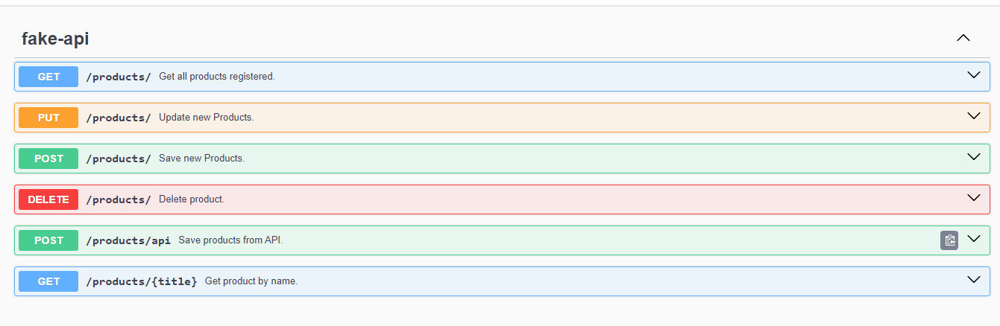
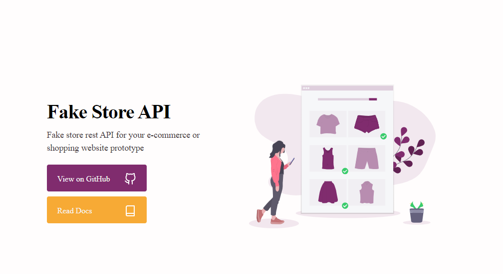

# Fake Store API

[](https://github.com/devsuperior/sds1-wmazoni/blob/master/LICENSE)

## Sobre o projeto

Este projeto foi desenvolvido com base no [vídeo](https://www.youtube.com/watch?v=XgN9E7oNJ-o&pp=ygUKamF2YSBuYXV0YQ%3D%3D) do canal Javanauta.

O objetivo deste projeto é utilizar o Feign Client para consumir a API externa [Fake Store API](https://fakestoreapi.com/). Além disso, o projeto utiliza um banco de dados MySQL para implementar um CRUD simples, otimizando a estrutura de dados através de DTOs.

A integração do Swagger com Spring Boot permite documentar a API de maneira clara e concisa, facilitando o entendimento e uso por outros desenvolvedores.

## Índice

- [Endpoints API](#endpoints-api)
- [Swagger](#swagger)
- [FakeStoreAPI](#fake-store-api-1)
- [Tecnologias Usadas](#tecnologias-usadas)
- [Instalação](#instalação)
- [Configuração](#configuração)
- [Autor e Contato](#autor-e-contato)

&nbsp;

## Endpoints API

### Retornar todos os produtos

<span style="color: #32CD32; font-weight: bold;">GET</span>

```http
  /products
```

<i style="color: #EE4B2B;">Sem parâmetros</i>

---

### Retornar pelo nome do produto

<span style="color: #32CD32; font-weight: bold;">GET</span>

```HTTP
  /products/{title}
```

| Parameter | Type     | Description                   |
| :-------- | :------- | :---------------------------- |
| `title`   | `String` | **Required**. Nome do produto |

---

### Criar um novo Produto

<span style="color: yellow	; font-weight: bold;">POST</span>

```htpp
  /products
```

Request Body<i style="color: #EE4B2B;"> - Obrigatório</i>

```json
{
  "entity_id": "string",
  "title": "string",
  "price": integer,
  "category": "string",
  "description": "string",
  "image": "string"
}
```

---

### Salvar produtos da API

<span style="color: yellow	; font-weight: bold;">POST</span>

```http
  /products/api
```

<i style="color: #EE4B2B;">Sem parâmetros</i>

---

### Atualizar um dados do produto

<span style="color: #00BFFF	; font-weight: bold;">PUT</span>

```http
  /products
```

| Parameter | Type     | Description                  |
| :-------- | :------- | :--------------------------- |
| `id`      | `String` | **Required**. ID do produto. |

Request Body<i style="color: #EE4B2B;"> - Obrigatório</i>

```json
{
  "entity_id": "string",
  "title": "string",
  "price": integer,
  "category": "string",
  "description": "string",
  "image": "string"
}
```

---

### Excluir um produto

<span style="color: #FF6347	; font-weight: bold;">DELETE</span>

```http
  /products
```

| Parameter | Type     | Description                    |
| :-------- | :------- | :----------------------------- |
| `title`   | `String` | **Required**. Nome do produto. |

---

&nbsp;

## Swagger



&nbsp;

## Fake Store API



&nbsp;


## Tecnologias Usadas

### Backend:

- Java 17
- Spring Boot (3.2.4)
- Spring LoadBalancer
- OpenFeign
- JPA/Hibernate
- Lombok
- Swagger (2.5.0)

### Dados

- MySQL

&nbsp;

## Instalação

### Pré-requisitos

- Java 17


&nbsp;

## Configuração

### Banco de Dados

```
Nessa aplicação foi usado o MySQL, mas você pode usar qualquer outro Banco Dados SQL. Você terá que configurar somente o Drive no Spring e a credencial para acessar o seu Banco de dados.


# Criar o Banco de dados

CREATE DATABASE fake_api_store;

# Alterar a configuração de conexão no arquivo 'application.yml' para o seu Banco de Dados:

url: jdbc:mysql://localhost:3306/fake_api_store
username: root
password: root@pass
```

### Backend

```
# clonar repositório
git clone https://github.com/erolkss/spring-swagger-external-api.git

# executar o projeto
./mvnw spring-boot:run
```


&nbsp;

## Autor e Contato

Lucas Eduardo Lima - [LinkedIn](https://www.linkedin.com/in/lucaserolima)

Para enviar feedback ou entrar em contato, por favor, envie um e-mail para `lucaserolima@gmail.com`.
